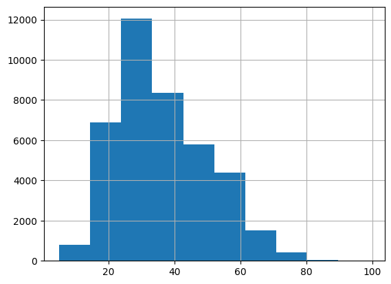
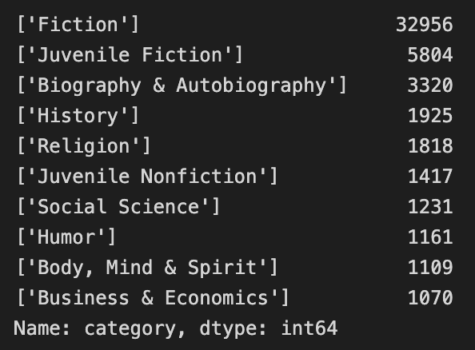

# Datasets
- train_ratings.csv
    - book rating data by users
        - `user_id, isbn, rating`
    - About 300k  interactions(-> 306795)
- users.csv
    - user information
        - `user_id, location, age `
- books.csv
    - book information
        - `isbn(unique id), book title, author, year of publication, publisher, img_url, language, category, summary, img_path`
---
## Users
- Number of Rows : 68092
### age
- `age`에 대한 결측치 존재 : 27833
    - 약 41%

- baseline에서는 age를 10의 배수로 binning후, 해당 결측치를 mean값으로 imputation
    - outlier가 significant 하지 않기 때문에 mean값으로 imputation해도 큰 문제는 없어 보임
    - 하지만, 해당 분포에 맞춰 random하게 age를 pick하도록 전처리

### location
- 결측치 None
- `location`의 경우 국가별, 지역별 편차가 너무 크고 존재하지 않거나 같은 지역을 다르게 표기한 경우가 많아 Feature로서 사용하기 어려움
---
## Books
- Number of Rows : 149570
- Null값이 있는 Feature들
    - language(67,227 : 약 45%)
    - category(68,857: 약 46%)
    - summary(67,227 : 약 45%)
    - img_path

### Category

- 책의 카테고리 간의 편차가 다소 큰 것을 확인 가능
- 하지만, 카테고리별 rating의 평균과 편차의 차이는 적음

### Language
- 총 26개의 unique 값이 존재

## Cold Start User
- 8266명 : 전체 유저의 10.78%

# Insight
- 개별 feature의 rating에 대한 영향력은 크지 않다고 판단
- 그렇다고 해서 무의미한 feature가 있다고 판단되지 않음
- 따라서, 몇가지의 feature만을 가지고 모델링을 하기 보다는 사용가능한 feature를 최대한 활용
    - 이를 위해서, Imputation과정에 집중